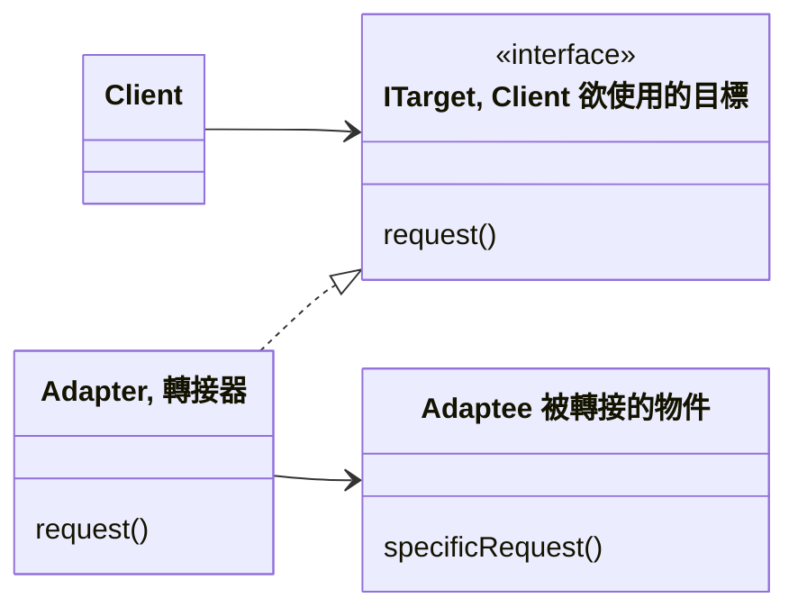

# Adapter

## 將一個類別的介面轉換為用戶端預期的另一個介面，它可以讓介面不相容的類別合作無間

```mermaid
classDiagram
    direction LR
    class ITarget["ITarget, Client 欲使用的目標"]
    <<interface>> ITarget
    ITarget : request()
    Client --> ITarget
    class Adapter["Adapter, 轉接器"]
    Adapter : request()
    Adapter ..|> ITarget
    class Adaptee["Adaptee 被轉接的物件"]
    Adapter --> Adaptee
    Adaptee : specificRequest()
```
