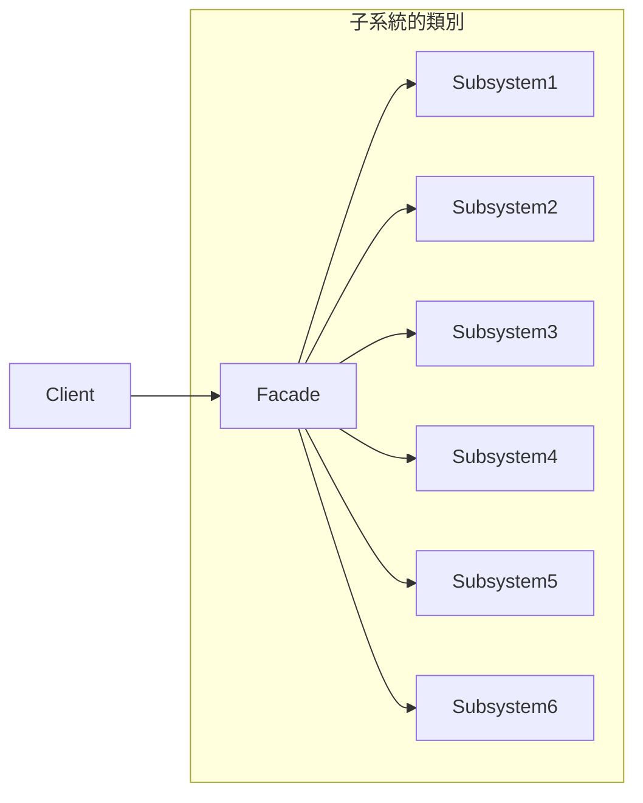

# 門面(Facade)

## 為子系統裡面的一組介面提供一格統一的介面，他定義了高階的介面，可讓子系統更容易運用

```mermaid
flowchart LR
    Client --> Facade
    subgraph 子系統的類別
        Facade --> Subsystem1
        Facade --> Subsystem2
        Facade --> Subsystem3
        Facade --> Subsystem4
        Facade --> Subsystem5
        Facade --> Subsystem6
    end
```
