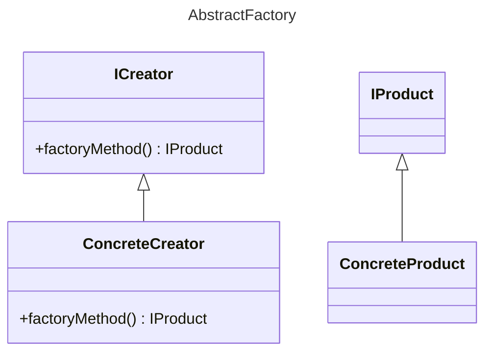
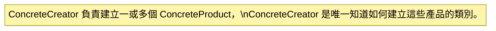

# memo

```mermaid
---
title: AbstractFactory
---
classDiagram
    ICreator <|-- ConcreteCreator
    ICreator : +factoryMethod() IProduct
    ConcreteCreator : +factoryMethod() IProduct
    IProduct <|-- ConcreteProduct
```

```mermaid
classDiagram
note "ConcreteCreator 負責建立一或多個 ConcreteProduct，\nConcreteCreator 是唯一知道如何建立這些產品的類別。"
```