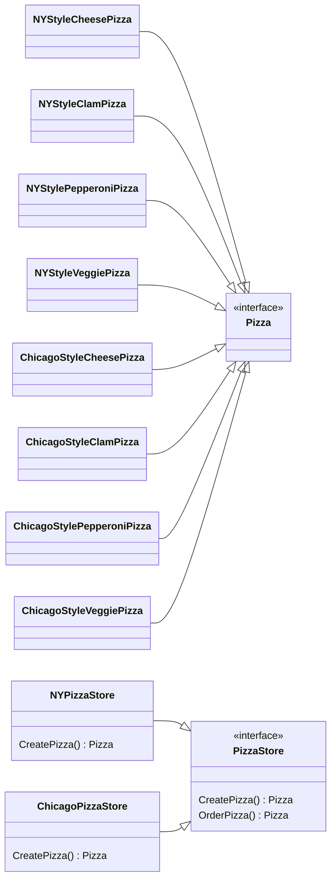
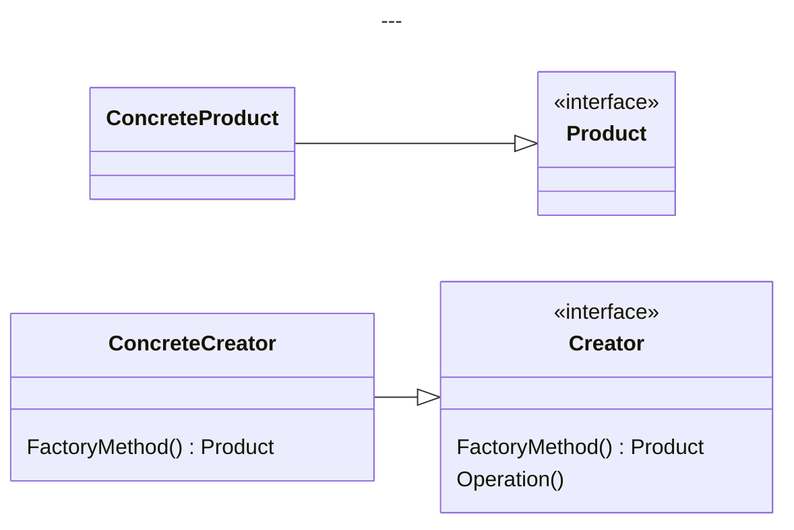

# Factory Method

1. 所有 ConcreteProduct 必須實現 Product。
2. Creator 定義工廠方法但不實作，且實現了操作 Product 的方法。
3. 所有 ConcreteCreator 必須實現 Creator。
4. ConcreteCreator 負責創建 ConcreteProduct，也只有他才有 ConcreteProduct 的視野。

