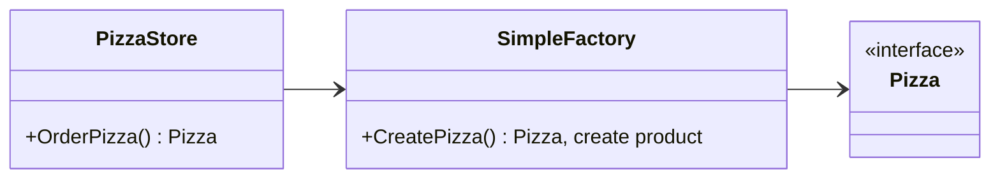
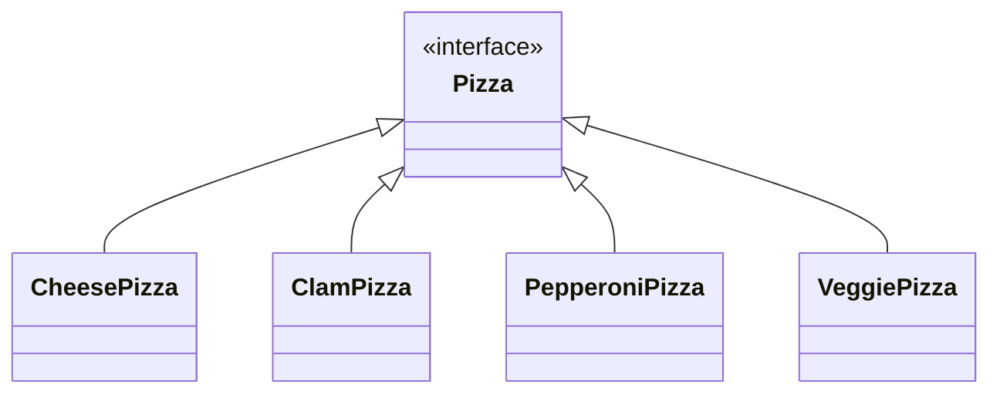
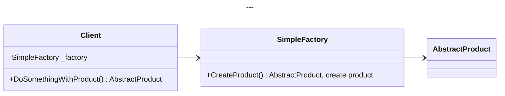

# Simple Factory

1. 客戶(Client)透過 簡單工廠(SimpleFactory)取得 具體產品類別(ConcreteProduct)
2. 應該只有 簡單工廠 能引用 具體產品類別。
3. 每個 具體產品類別 都實現了 抽象產品。

```mermaid
classDiagram
    direction LR
    PizzaStore --> SimpleFactory
    SimpleFactory --> Pizza
    <<interface>> Pizza
    class PizzaStore {
        +OrderPizza() Pizza
    }
    class SimpleFactory {
        +CreatePizza() Pizza, create product
    }
    
```

```mermaid
classDiagram
    direction DT
    Pizza <|-- CheesePizza
    Pizza <|--ClamPizza
    Pizza <|--PepperoniPizza
    Pizza <|--VeggiePizza
    <<interface>> Pizza
```

```mermaid
---
title: ---
---
classDiagram
    direction LR
    Client --> SimpleFactory
    SimpleFactory --> AbstractProduct
    class Client {
        -SimpleFactory _factory
        +DoSomethingWithProduct() AbstractProduct
    }
    class SimpleFactory {
        +CreateProduct() AbstractProduct, create product
    }
```
