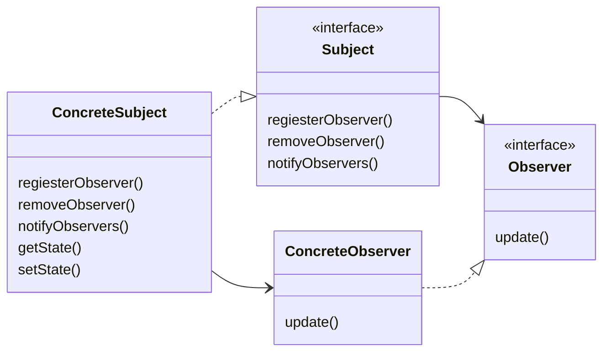

# Observer(觀察者)

## 定義物件之間的一對多依賴關係，當一個物件改變狀態時，依賴它的物件都會自動收到通知與更新

```mermaid
classDiagram
    direction LR
    class Subject{
        <<interface>>
        regiesterObserver()
        removeObserver()
        notifyObservers()
    }
    class Observer{
        <<interface>>
        update()
    }
    Subject --> Observer

    class ConcreteSubject{
        regiesterObserver()
        removeObserver()
        notifyObservers()
        getState()
        setState()
    }
    class ConcreteObserver{
        update()
    }
    ConcreteSubject --> ConcreteObserver
    ConcreteSubject ..|> Subject
    ConcreteObserver ..|> Observer
```
