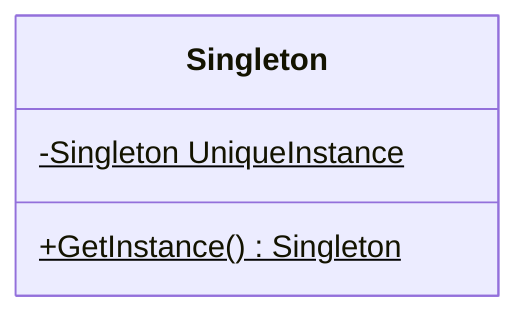

# Singleton(單例模式)

**The Singleton Pattern** ensures a class has only one instance, and provides a global point of access to it

**單利模式**可以確保一個類別只有一個實例，並且提供一個全域接觸點

1. UniqueInstance 類別變數保存唯一的實例類別
2. GetInstance() 方法被宣告成 static，所以可以在程式任何地方來呼叫此方法
3. 我們從單例模式得到惰性實例化的好處

