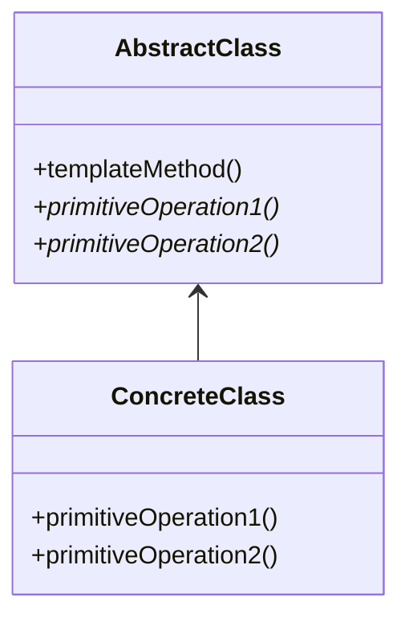

# Template Method(樣板方法)

Hollywood Principle(好萊塢原則): "Don’t call us, we’ll call you"(別打給我們，我們會打給你)

1. 抽象類別裡有樣板方法以及樣板方法操作需要的抽象版本
2. 實作類別可能有很多個，他們實作樣板方法需要的實際操作

```mermaid
classDiagram
    direction UP
    class AbstractClass {
        +templateMethod()
        +primitiveOperation1()*
        +primitiveOperation2()*
    }
    class ConcreteClass {
        +primitiveOperation1()
        +primitiveOperation2()
    }
    AbstractClass< -- ConcreteClass
```
