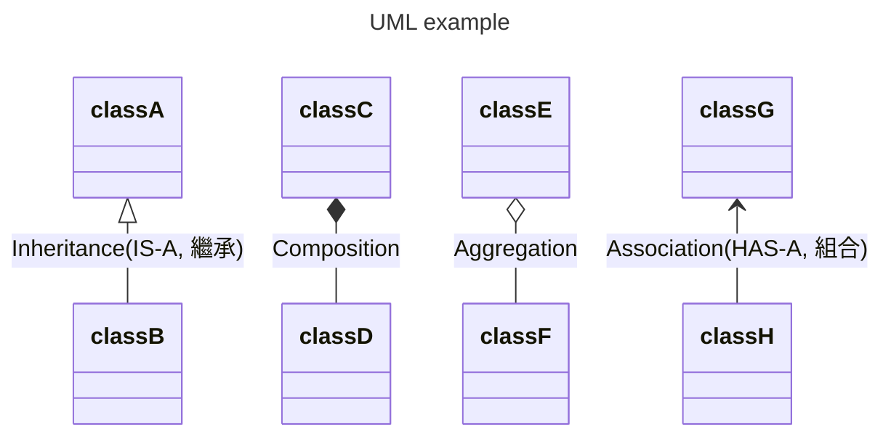
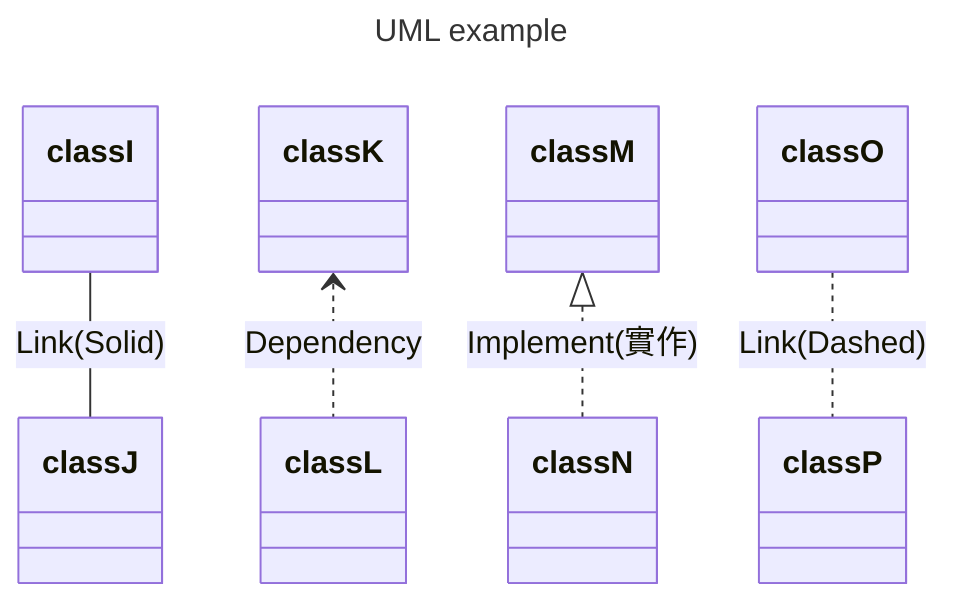

# UML

```mermaid
---
title: UML example
---
classDiagram
    classA <|-- classB : Inheritance(IS-A, 繼承)
    classC *-- classD : Composition
    classE o-- classF : Aggregation
    classG <-- classH : Association(HAS-A, 組合)
```

```mermaid
---
title: UML example
---
classDiagram
    classI -- classJ : Link(Solid)
    classK <.. classL : Dependency
    classM <|.. classN : Implement(實作)
    classO .. classP : Link(Dashed)
```